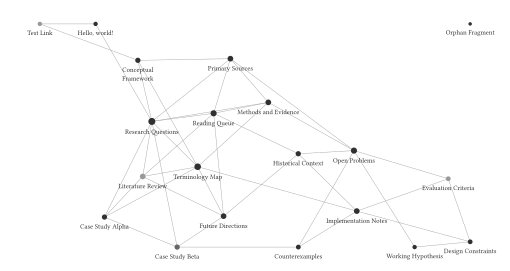

[中文](README.zh-CN.md)

# Proof of Concept: A Typst-native Zettelkasten Note System

  

<em>A knowledge graph, built natively in Typst.</em>

Evaluate a Zettelkasten note system with Typst.

## Motivation

We realized that the operations of [zk-lsp.typ](https://github.com/pxwg/zk-lsp.typ) can be understood as compositions of the following:

- Abstracting a Typst-based Zettelkasten note system as a graph: modeling note references as a directed semantic multigraph and expressing information attached to its nodes and edges.
- Using the attached information from local graph construction to evaluate the semantics of the whole graph—or at least a relevant subgraph—such as formatting and task reconciliation.

In the original implementation, the graph structure itself is general, but note content must first be converted into the binary's internal data structures. [zk-lsp.typ](https://github.com/pxwg/zk-lsp.typ) performs this conversion through hard-coded rules, heuristic searches, or handwritten parsers, which limits both accuracy and flexibility.

To let a standalone binary LSP analyze notes, the original implementation stores metadata outside Typst files. Completion schemas must therefore be maintained separately, making it difficult to reuse the editing experience provided by Typst and Tinymist. Adding or changing fields often also requires modifying Rust source code. This is a serious limitation for a highly customizable system that needs clear structures to remain manageable as it grows.

The original implementation also offers limited customization for global semantic computation, requiring users to move between scripting languages, `zk-lsp` configuration files, and Typst.

Our solution is to move all Zettelkasten-related computation into Typst's scripting engine and evaluate it using the incremental compilation capabilities of Typst and Tinymist. Users can express new metadata, graph queries, and global semantic rules directly in Typst without modifying Rust for each rule. Evaluation in the editor and document compilation consequently use the same definitions.

In this design, Typst is the sole semantic evaluator. Rust, Tinymist, and other host code should not parse notes again. They only construct the incremental computation environment for the Typst World and act as handlers for algebraic effects produced by Typst.

This project is a proof of concept investigating whether Typst can perform graph abstraction and global semantic computation for a Zettelkasten system, allowing later host handlers to execute the operations described by the resulting values.

## Milestones

- [x] Graph abstraction and representations of Node, Edge, and Observation
- [x] Missing/Legacy/Archived diagnostics: Typst now produces side-effect-free diagnostic values; a later LSP handler will recover spans and publish them to the editor
- [x] Native lazy loading for the note library, reducing memory use while preserving Tinymist completion and navigation
- [ ] Improve the type-safe API and metadata editing experience
- [ ] Reproduce the original global semantic inference
  - [ ] Task tracking (`zk-lsp reconcile`)
  - [ ] Formatter logic (compute metadata from text content)
